 

**Elastic Security Logging & Incident Platform**

[](https://opensource.org/licenses/MIT)

[](https://docker.com)

[](https://python.org)

  
A lightweight MISP and TheHive alternative for managing Indicators of Compromise (IOCs), investigating security incidents, and organizing security operations with AI-powered insights.

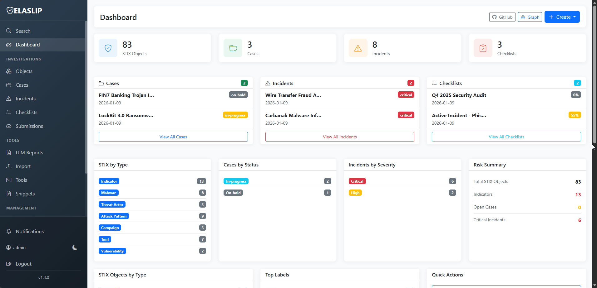
## Key Features


- **STIX objects management** - deduplication, enrichment, relationship mapping

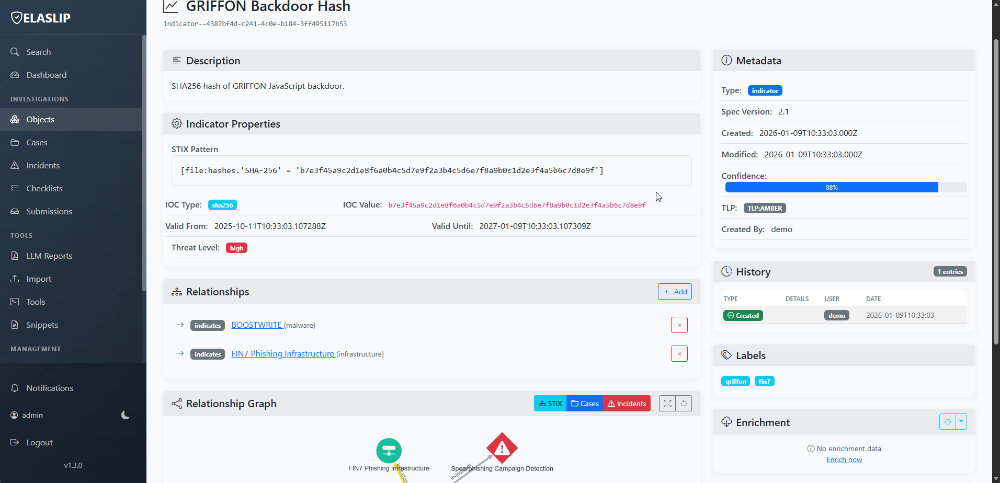

- **Case & Incident Investigation** - Organize investigations with timeline events, comments, and STIX linking
	- Case management :
		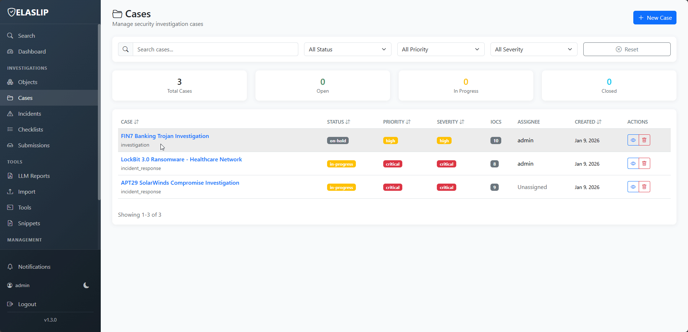
	- Incident management : 
		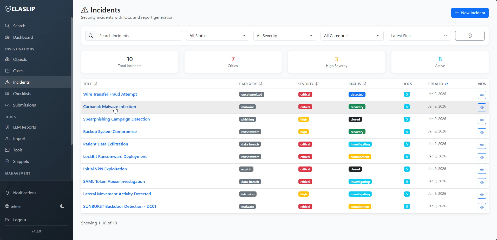
	- Checklists :
		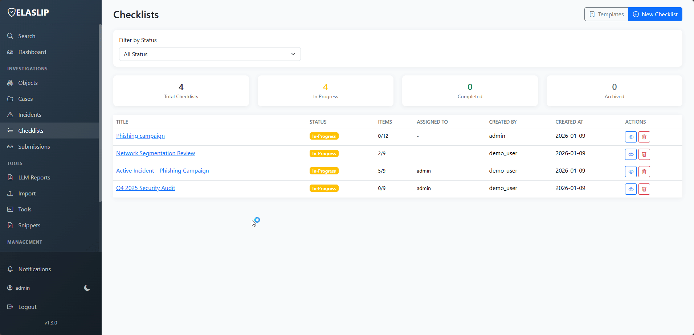

- **AI-Powered Reports** - Generate STIX, case, incident, and checklist reports via LLM (Ollama or OpenAI-compatible)
	- Settings :
		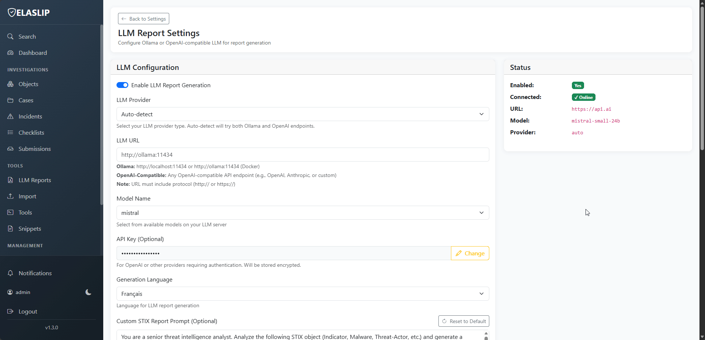
	- Report generation :
		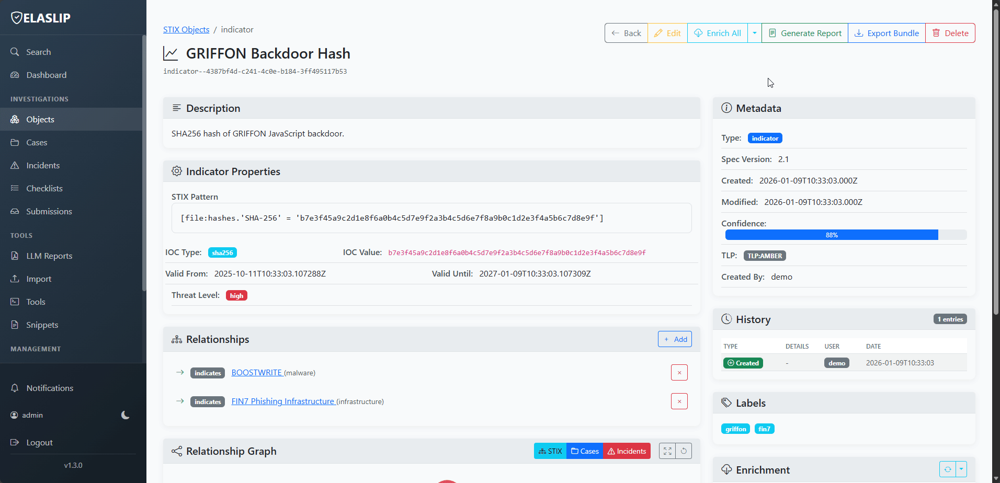

- **Advanced Search** - Full-text and pattern-based search with interactive graphs vizualisation
- **Reconnaissance Tools** - WHOIS, Ping, Nmap, Traceroute, DNS, GeoIP, Email Headers, File Analysis, DMARC/DKIM, URL Scan, Shodan Device Search, URL Scan
		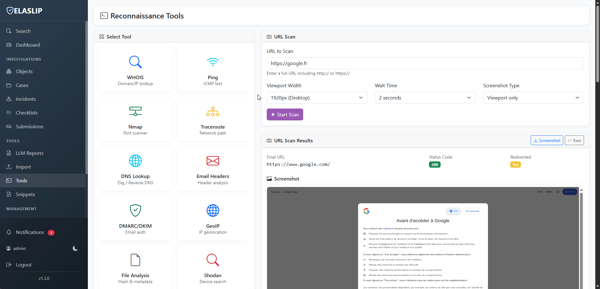
- **Two-Factor Authentication** - TOTP support with backup codes and OAuth2 Integration (Google, GitHub and OIDC Providers)
		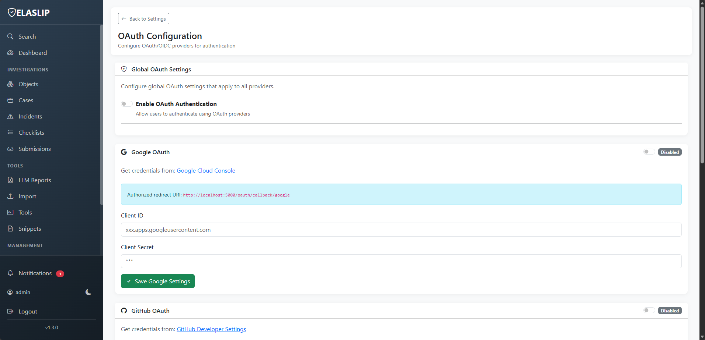
		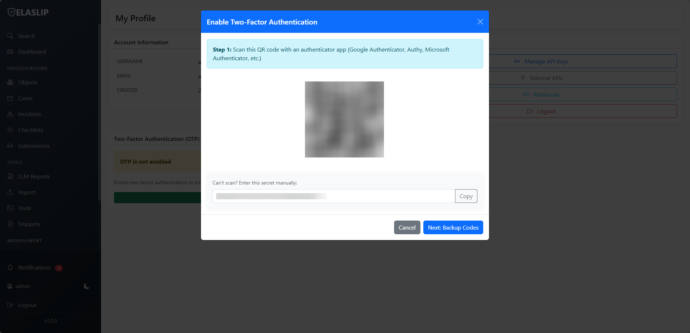
- **RBAC & Audit Logging** - Granular permissions and complete audit trail
		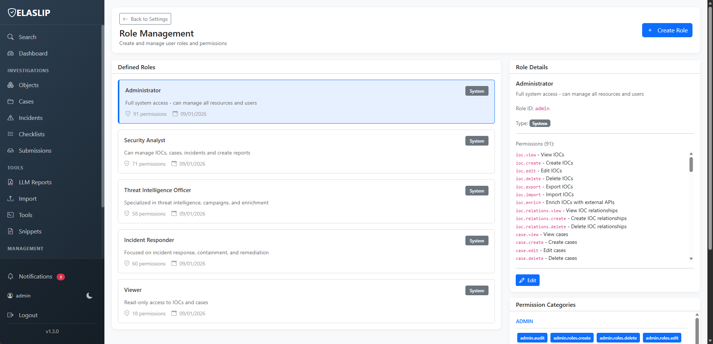
		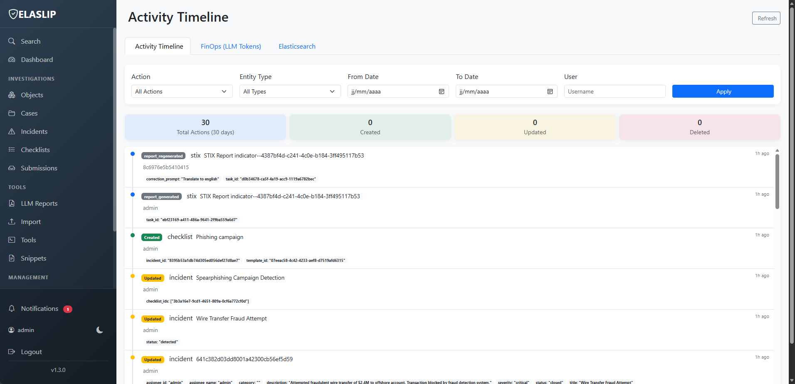
- **Public Portal** - Anonymous IOC submissions and public search
		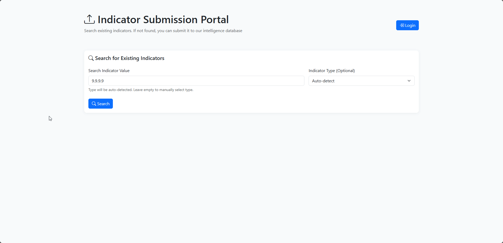
- **External enrichment** - Custom API Integration from external providers
- **Dark Mode** - Eye-friendly theme support
- **LLM Tracker Dashboard** - LLM token usage tracking and analytics
- **Webhooks & Notifications** - Real-time event notifications
- **API First** - Token-based programmatic access with Swagger documentation

## Integrated Tools


| Tool | Description |

|------|-------------|
| **WHOIS** | Domain and IP ownership information |
| **Ping** | Host connectivity and latency testing |
| **Nmap** | Network scanning and service enumeration |
| **Traceroute** | Network path analysis |
| **DNS Lookup** | DNS record resolution (A, AAAA, CNAME, MX, NS, TXT, SOA) |
| **Reverse DNS** | IP to hostname resolution |
| **GeoIP** | IP geolocation and organization lookup (single/bulk) |
| **Email Headers** | Email header parsing, hop analysis, source IP extraction |
| **File Analysis** | Hash extraction (MD5/SHA1/SHA256), metadata, EXIF, entropy |
| **DMARC/DKIM/SPF** | Email authentication record analysis |
| **URL Scan** | Automated URL analysis and insights |
| **Shodan** | Internet-facing device search (requires API key) |

  
## Quick Start

  ### Prerequisites
- Docker & Docker Compose
- (Optional) Ollama for AI reports
### Installation
 

```bash

git clone <repo-url>
cd ELASLIP
cp .env.example .env

# Start with included Elasticsearch
docker-compose up -d
# Or with external Elasticsearch
docker-compose -f docker-compose.external-elasticsearch.yml up -d
# Initialize
docker-compose exec app python scripts/init_elasticsearch.py
# Create admin user
docker-compose exec app python scripts/create_admin.py
# Access
# Web: http://localhost:5000
# API Docs: http://localhost:5000/api-docs
```

  

### Demo Data (Optional)

set `DEMO_DATA_ENABLED=true` in `.env` before startup.

```bash
docker-compose exec app python scripts/demo_data.py
```

## Supported STIX Types Types

  
Threat Intelligence :
- Indicator (IOC)
- Malware
- Threat Actor
- Attack Pattern
- Campaign
- Intrusion Set

Tools & Vulnerabilities :
- Tool
- Vulnerability
- Infrastructure

Context Objects :
- Identity
- Location
- Course of Action

Documentation & Analysis
- Report
- Note
- Opinion
- Observer Data

  

## Environment Variables

  

| Variable | Default | Description |

|---|---|---|

| `FLASK_ENV` | `development` | Flask environment |

| `FLASK_APP` | `app` | Flask application entrypoint |

| `SECRET_KEY` | `your-super-secret-key-change-in-production` | Flask secret key (change in production) |

| `SITE_NAME` | `ELASLIP` | Site short name |

| `SITE_TITLE` | `ELASLIP` | Site full title |

| `ELASTICSEARCH_URL` | `http://localhost:9200` | Elasticsearch URL |

| `ELASTICSEARCH_USER` | `elastic` | Elasticsearch username |

| `ELASTICSEARCH_PASSWORD` | `elastic123` | Elasticsearch password |

| `ELASTICSEARCH_MEMORY_XMS` | `256m` | ES JVM initial heap size |

| `ELASTICSEARCH_MEMORY_XMX` | `256m` | ES JVM max heap size |

| `REDIS_URL` | `redis://localhost:6379/0` | Redis URL (sessions/cache) |

| `CELERY_BROKER_URL` | `redis://localhost:6379/1` | Celery broker URL |

| `DEFAULT_ADMIN_USER` | `admin` | Default admin username |

| `DEFAULT_ADMIN_PASSWORD` | `admin123` | Default admin password |

| `DEMO_DATA_ENABLED` | `false` | Populate demo data on first run |

| `DEBUG` | `false` | Flask debug flag |

| `LLM_ENABLED` | `false` | Enable AI-based report generation |

| `LLM_PROVIDER` | `auto` | LLM provider (`auto`, `ollama`, `openai`) |

| `LLM_URL` | `http://ollama:11434` | LLM provider URL |

| `LLM_MODEL` | `mistral` | Default LLM model |

| `LLM_API_KEY` | `` | API key for OpenAI-compatible providers |

| `LLM_GENERATION_LANGUAGE` | `fr` | Default language for generated reports |

| `PUBLIC_SEARCH_ENABLED` | `true` | Enable public search portal |

| `PUBLIC_SUBMISSIONS_SUBMIT_ENABLED` | `true` | Enable public IOC submission form |

| `PUBLIC_SUBMISSIONS_MAX_RESULTS` | `10` | Max results for public search |

| `PUBLIC_SUBMISSIONS_ALLOW_ANONYMOUS` | `true` | Allow anonymous submissions |

| `ENRICHMENT_CACHE_TTL` | `3600` | Enrichment cache TTL in seconds |

| `GEOIP_ENABLED` | `true` | Enable IP-API.com GeoIP enrichment |

| `SHODAN_API_KEY` | `` | Shodan API key for device search |

| `SHODAN_ENABLED` | `false` | Enable Shodan device search tool |

| `OAUTH_ENABLED` | `false` | Enable OAuth authentication (Google, GitHub, OIDC) |

| `OAUTH_ENCRYPTION_KEY` | `` | Encryption key for OAuth credentials (required when OAuth enabled) |

| `OAUTH_AUTO_CREATE_USER` | `true` | Automatically create users on first OAuth login |

| `OAUTH_AUTO_LINK_BY_EMAIL` | `false` | Link OAuth accounts to existing users by email |

| `OAUTH_DEFAULT_ROLE` | `viewer` | Default role for new OAuth users |

| `OAUTH_GOOGLE_ENABLED` | `false` | Enable Google OAuth |

| `OAUTH_GOOGLE_CLIENT_ID` | `` | Google OAuth Client ID |

| `OAUTH_GOOGLE_CLIENT_SECRET` | `` | Google OAuth Client Secret |

| `OAUTH_GITHUB_ENABLED` | `false` | Enable GitHub OAuth |

| `OAUTH_GITHUB_CLIENT_ID` | `` | GitHub OAuth Client ID |

| `OAUTH_GITHUB_CLIENT_SECRET` | `` | GitHub OAuth Client Secret |

| `OAUTH_OIDC_ENABLED` | `false` | Enable OIDC provider |

| `OAUTH_OIDC_CLIENT_ID` | `` | OIDC Client ID |

| `OAUTH_OIDC_CLIENT_SECRET` | `` | OIDC Client Secret |

| `OAUTH_OIDC_DISCOVERY_URL` | `` | OIDC Discovery URL |

| `OAUTH_OIDC_PROVIDER_NAME` | `` | OIDC Provider name |

  

See `.env.example` for complete defaults and examples.

  

## Docker Deployment

  

Four Docker Compose configurations available:

  

| Setup | Command | Features |

|-------|---------|----------|

| **Standard** | `docker-compose up -d` | Embedded Elasticsearch, no VPN |

| **Standard + VPN** | `docker-compose -f docker-compose.vpn.yml up -d` | Embedded ES, worker via VPN tunnel |

| **External ES** | `docker-compose -f docker-compose.external-elasticsearch.yml up -d` | External Elasticsearch, no VPN |

| **External ES + VPN** | `docker-compose -f docker-compose.external-elasticsearch.vpn.yml up -d` | External ES, worker via VPN tunnel |

  

### VPN Setup (Optional)

  

To enable VPN routing for worker tasks:

  

1. **Add to `.env`:**

   ```bash

   VPN_SERVICE_PROVIDER=custom

   VPN_TYPE=openvpn

   ```

  

2. **Prepare OpenVPN config** (`vpn/custom.ovpn`):

   - Must include `<cert>`, `<key>`, and `<tls-crypt>` sections

   - Use inline `<auth-user-pass>` with credentials

   - Comment out resolver scripts: `#up /etc/openvpn/...`

  

3. **Start with VPN:**

   ```bash

   docker-compose -f docker-compose.vpn.yml up -d

   ```

  

4. **Verify:**

   ```bash

   # Worker IP should match VPN provider

   docker exec elaslip-worker curl -s https://ipinfo.io

   ```

  

## Development

  

```bash

#Linux

python -m venv venv

source venv/bin/activate

pip install -r requirements.txt

docker-compose up -d elasticsearch redis

flask run --debug

  
  

#Windows

py -3.12 -m venv venv

venv\Scripts\activate

pip install -r requirements.txt

docker-compose up -d elasticsearch redis

flask run --debug

```

  

## Architecture

  

```

┌─────────────────┐    ┌─────────────────┐    ┌─────────────────┐

│   Web Frontend  │    │   Flask API     │    │   Elasticsearch │

│   (Bootstrap)   │◄──►│   (Python)      │◄──►│   (Search DB)   │

└─────────────────┘    └─────────────────┘    └─────────────────┘

         │                       │                       │

         ▼                       ▼                       ▼

┌─────────────────┐    ┌─────────────────┐    ┌─────────────────┐

│   Redis Cache   │    │   Celery Tasks  │    │   File Storage  │

│   (Sessions)    │    │   (Async Jobs)  │    │    (Uploads)    │

└─────────────────┘    └─────────────────┘    └─────────────────┘

         │

         ▼

┌─────────────────┐

│   VPN Tunnel    │  (Optional)

│   (Gluetun)     │  Routes worker traffic

└─────────────────┘

```

  

**Core Components:**

- **Flask Backend** - REST API with RBAC authentication

- **Elasticsearch** - Full-text search and data storage

- **Redis** - Caching, sessions, and Celery broker

- **Celery** - Asynchronous task processing (optionally through VPN)

- **Bootstrap UI** - Responsive web interface

- **Gluetun VPN** (Optional) - Worker traffic routing for secure enrichment and external API calls

  

### Development Setup

  

```bash

# Clone repository

git clone <repo-url>

cd ELASLIP

  

# Create virtual environment

python -m venv venv

source venv/bin/activate  # or venv\Scripts\activate on Windows

  

# Install dependencies

pip install -r requirements.txt

  

# Start services

docker-compose up -d elasticsearch redis

  

# Run development server

flask run --debug

```

  

## License

  

This project is licensed under the MIT License - see the [LICENSE](LICENSE) file for details.

  

## Acknowledgments

  

- Built with [Flask](https://flask.palletsprojects.com/)

- Search powered by [Elasticsearch](https://www.elastic.co/)

- UI styled with [Bootstrap](https://getbootstrap.com/)

- Icons from [Bootstrap Icons](https://icons.getbootstrap.com/)